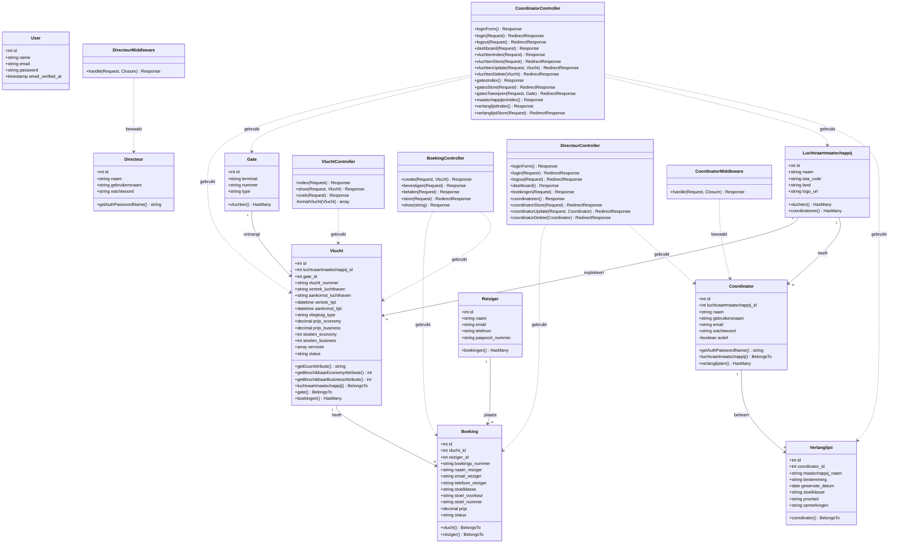

# Class Diagram — Chopped Schiphol

```mermaid
classDiagram

    class User {
        +int id
        +string name
        +string email
        +string password
        +timestamp email_verified_at
    }

    class Luchtvaartmaatschappij {
        +int id
        +string naam
        +string iata_code
        +string land
        +string logo_url
        +vluchten() HasMany
        +coordinatoren() HasMany
    }

    class Gate {
        +int id
        +string terminal
        +string nummer
        +string type
        +vluchten() HasMany
    }

    class Vlucht {
        +int id
        +int luchtvaartmaatschappij_id
        +int gate_id
        +string vlucht_nummer
        +string vertrek_luchthaven
        +string aankomst_luchthaven
        +datetime vertrek_tijd
        +datetime aankomst_tijd
        +string vliegtuig_type
        +decimal prijs_economy
        +decimal prijs_business
        +int stoelen_economy
        +int stoelen_business
        +array services
        +string status
        +getDuurAttribute() string
        +getBeschikbaarEconomyAttribute() int
        +getBeschikbaarBusinessAttribute() int
        +luchtvaartmaatschappij() BelongsTo
        +gate() BelongsTo
        +boekingen() HasMany
    }

    class Coordinator {
        +int id
        +int luchtvaartmaatschappij_id
        +string naam
        +string gebruikersnaam
        +string email
        +string wachtwoord
        +boolean actief
        +getAuthPasswordName() string
        +luchtvaartmaatschappij() BelongsTo
        +verlanglijsten() HasMany
    }

    class Directeur {
        +int id
        +string naam
        +string gebruikersnaam
        +string wachtwoord
        +getAuthPasswordName() string
    }

    class Reiziger {
        +int id
        +string naam
        +string email
        +string telefoon
        +string paspoort_nummer
        +boekingen() HasMany
    }

    class Boeking {
        +int id
        +int vlucht_id
        +int reiziger_id
        +string boekings_nummer
        +string naam_reiziger
        +string email_reiziger
        +string telefoon_reiziger
        +string stoelklasse
        +string stoel_voorkeur
        +string stoel_nummer
        +decimal prijs
        +string status
        +vlucht() BelongsTo
        +reiziger() BelongsTo
    }

    class Verlanglijst {
        +int id
        +int coordinator_id
        +string maatschappij_naam
        +string bestemming
        +date gewenste_datum
        +string stoelklasse
        +string prioriteit
        +string opmerkingen
        +coordinator() BelongsTo
    }

    class VluchtController {
        +index(Request) Response
        +show(Request, Vlucht) Response
        +zoek(Request) Response
        -formatVlucht(Vlucht) array
    }

    class BoekingController {
        +create(Request, Vlucht) Response
        +bevestigen(Request) Response
        +betalen(Request) Response
        +store(Request) RedirectResponse
        +show(string) Response
    }

    class CoordinatorController {
        +loginForm() Response
        +login(Request) RedirectResponse
        +logout(Request) RedirectResponse
        +dashboard(Request) Response
        +vluchtenIndex(Request) Response
        +vluchtenStore(Request) RedirectResponse
        +vluchtenUpdate(Request, Vlucht) RedirectResponse
        +vluchtenDelete(Vlucht) RedirectResponse
        +gatesIndex() Response
        +gatesStore(Request) RedirectResponse
        +gatesToewijzen(Request, Gate) RedirectResponse
        +maatschappijenIndex() Response
        +verlanglijstIndex() Response
        +verlanglijstStore(Request) RedirectResponse
    }

    class DirecteurController {
        +loginForm() Response
        +login(Request) RedirectResponse
        +logout(Request) RedirectResponse
        +dashboard() Response
        +boekingen(Request) Response
        +coordinatoren() Response
        +coordinatorStore(Request) RedirectResponse
        +coordinatorUpdate(Request, Coordinator) RedirectResponse
        +coordinatorDelete(Coordinator) RedirectResponse
    }

    class CoordinatorMiddleware {
        +handle(Request, Closure) Response
    }

    class DirecteurMiddleware {
        +handle(Request, Closure) Response
    }

    Luchtvaartmaatschappij "1" --> "N" Vlucht : exploiteert
    Luchtvaartmaatschappij "1" --> "N" Coordinator : heeft
    Gate "1" --> "N" Vlucht : ontvangt
    Vlucht "1" --> "N" Boeking : heeft
    Reiziger "1" --> "N" Boeking : plaatst
    Coordinator "1" --> "N" Verlanglijst : beheert

    VluchtController ..> Vlucht : gebruikt
    BoekingController ..> Boeking : gebruikt
    BoekingController ..> Vlucht : gebruikt
    CoordinatorController ..> Vlucht : gebruikt
    CoordinatorController ..> Gate : gebruikt
    CoordinatorController ..> Luchtvaartmaatschappij : gebruikt
    CoordinatorController ..> Verlanglijst : gebruikt
    DirecteurController ..> Boeking : gebruikt
    DirecteurController ..> Coordinator : gebruikt

    CoordinatorMiddleware ..> Coordinator : bewaakt
    DirecteurMiddleware ..> Directeur : bewaakt
```
