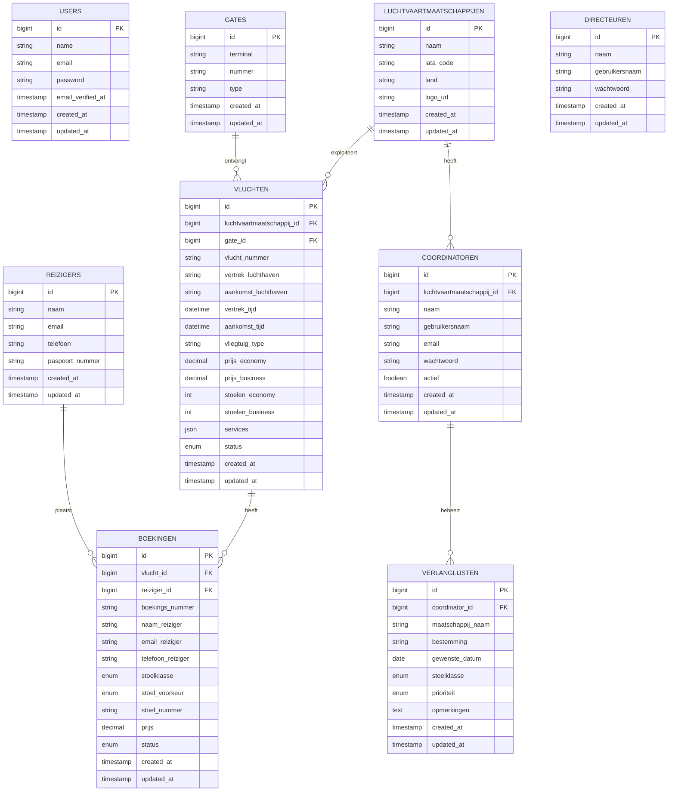

# ERD — Chopped Schiphol

## Entity Relationship Diagram

---

## Toelichting relaties

| Relatie | Type | Beschrijving |
|---------|------|-------------|
| Luchtvaartmaatschappij → Vluchten | 1:N | Één maatschappij exploiteert meerdere vluchten |
| Luchtvaartmaatschappij → Coordinatoren | 1:N | Één maatschappij heeft meerdere coördinatoren |
| Gate → Vluchten | 1:N | Één gate ontvangt meerdere vluchten (op verschillende tijden) |
| Vlucht → Boekingen | 1:N | Één vlucht heeft meerdere boekingen |
| Reiziger → Boekingen | 1:N | Één reiziger kan meerdere boekingen plaatsen |
| Coordinator → Verlanglijsten | 1:N | Één coördinator heeft een persoonlijke verlanglijst |

---

## Enum waarden

| Tabel | Kolom | Waarden |
|-------|-------|---------|
| vluchten | status | `gepland`, `vertrokken`, `geland`, `geannuleerd` |
| boekingen | stoelklasse | `economy`, `business` |
| boekingen | stoel_voorkeur | `raam`, `midden`, `gangpad` |
| boekingen | status | `in_afwachting`, `bevestigd`, `geannuleerd` |
| verlanglijsten | stoelklasse | `economy`, `business` |
| verlanglijsten | prioriteit | `hoog`, `normaal`, `laag` |
| gates | type | `standaard`, `uitgebreid` |
